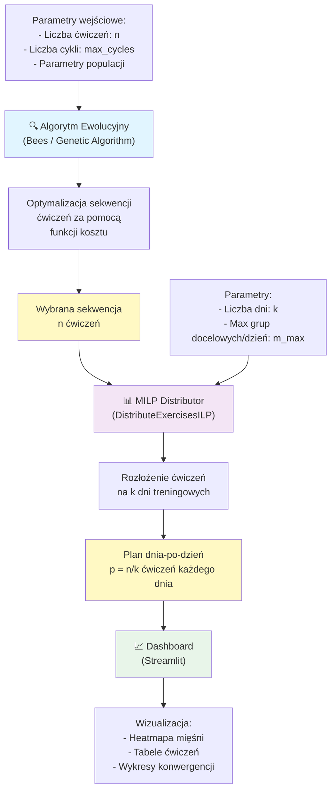

# Opis Problemu i Funkcja Kosztu

Poniższy dokument przedstawia matematyczne sformułowanie problemu optymalizacji planu treningowego. Celem jest znalezienie takiej sekwencji ćwiczeń, która w sposób zrównoważony obciąża grupy mięśniowe, uwzględniając jednocześnie specyficzne preferencje użytkownika.

## Dane

W modelu wykorzystujemy następujące parametry:

* **$G$ — Grupy mięśniowe:** Zbiór wszystkich grup mięśniowych branych pod uwagę.
* **$T \subseteq G^3$ — Dostępne ćwiczenia:** Zbiór dostępnych ćwiczeń, gdzie każde ćwiczenie jest zdefiniowane jako trójka: (**target** - docelowa, **synergist** - współpracująca, **stabilizer** - stabilizująca).
* **$n \in \mathbb{N}$ — Liczba ćwiczeń:** Planowana liczba ćwiczeń do wykonania w danej jednostce treningowej.
* **$\alpha \in \mathbb{R}^{|G|}$ — Wagi grup mięśniowych:** Wektor wag określający priorytety dla poszczególnych grup mięśniowych (wyższa waga = większy priorytet).
* **$\beta \in \mathbb{R}^3$ — Wagi stopni intensywności:** Wektor wag przypisany do ról mięśni (target, synergist, stabilizer), określający siłę ich zaangażowania.
* **$\gamma \in \mathbb{R}$ — Współczynnik równowagi:** Parametr kontrolujący, jak ważna jest dla nas równomierność treningu w stosunku do preferencji $\alpha$.

---

## Szukane

Celem jest znalezienie sekwencji $n$ ćwiczeń $x \in T^n$, która minimalizuje funkcję kosztu:

$$C(X) = \gamma \left\| \overline{\beta^T X} - \beta^T X \right\|_2 - \beta^T X \alpha$$

Gdzie macierz $X$ (o wymiarach $3 \times |G|$) jest reprezentacją planu $x$ taką, że:
* **$X_{ij}$** to liczba wystąpień $j$-tej grupy mięśniowej w $i$-tym stopniu intensywności (roli) w całym planie $x$.

### Wyjaśnienie składników funkcji kosztu:

1.  **$\beta^T X$**: Wektor reprezentujący całkowite, ważone obciążenie dla każdej grupy mięśniowej.
2.  **$\overline{\beta^T X}$**: Wektor średniego obciążenia (idealny stan, w którym każdy mięsień pracuje tyle samo).
3.  **$\gamma \left\| \dots \right\|_2$**: Składnik odpowiedzialny za **wariancję**. Minimalizacja tego członu dąży do tego, aby różnice w obciążeniu poszczególnych mięśni były jak najmniejsze (równomierny rozwój).
4.  **$-\beta^T X \alpha$**: Składnik odpowiedzialny za **preferencje**. Minimalizacja tego członu (poprzez odejmowanie) promuje wybieranie tych grup mięśniowych, które mają przypisane wysokie wagi w wektorze $\alpha$.

---

## Ogólny pomysł

Logika optymalizacji opiera się na dwóch filarach:
* **Równowaga ($\gamma$):** Chcemy uniknąć sytuacji, w której niektóre grupy mięśniowe są skrajnie przetrenowane, a inne pominięte.
* **Personalizacja ($\alpha$):** Jeśli mamy kilka podobnych rozwiązań o zbliżonej równowadze, wybieramy to, które kładzie większy nacisk na grupy mięśniowe, na których najbardziej nam zależy.

---

## Dystrybucja Ćwiczeń na Dni Treningowe (MILP)

Po wyborze sekwencji $n$ ćwiczeń za pomocą algorytmu ewolucyjnego (Bees Algorithm lub Genetic Algorithm), wybraną sekwencję należy rozłożyć na $k$ dni treningowych, po $p = n/k$ ćwiczeń każdego dnia. Problem ten rozwiązuje algorytm **Mixed-Integer Linear Programming (MILP)**.

### Sformułowanie Problemu

Dysponujemy:
* **Wybrane ćwiczenia:** $n$ ćwiczeń wybranych przez algorytm heurystyczny, reprezentowanych jako wektory indeksów.
* **Liczba dni treningowych:** $k \in \mathbb{N}$ (np. 3, 5 dni).
* **Maksymalna liczba docelowych grup mięśniowych na dzień:** $m_{\max} \in \mathbb{N}$ (np. 3 — każdy dzień skupia się na co najwyżej 3 grupach docelowych).

### Zmienne Decyzyjne

1. **$z_{i,d} \in \{0, 1\}$** — ćwiczenie $i$ jest przypisane do dnia $d$.
2. **$y_{t,d} \in \{0, 1\}$** — grupa docelowa $t$ jest aktywna (pojawia się) w dniu $d$.
3. **$w_{d,g} \geq 0$** — zmienna pomocnicza do linearyzacji wartości bezwzględnej: $w_{d,g} \geq |L_{d,g} - \mu_d|$, gdzie $L_{d,g}$ to całkowite ważone obciążenie mięśnia $g$ w dniu $d$.

### Funkcja Celu

Minimalizujemy:

$$\text{Obj} = \gamma \sum_{d=1}^{k} \sum_{g=1}^{|G|} w_{d,g} - \sum_{d=1}^{k} \sum_{g=1}^{|G|} L_{d,g} \cdot \alpha_g$$

Gdzie:
* **Pierwszy termin** ($\gamma \sum w_{d,g}$): penalizuje nierównomierny rozkład obciążenia między grupy mięśniowe w każdym dniu (zmniejsza wariancję dzienną).
* **Drugi termin** ($-\sum L_{d,g} \cdot \alpha_g$): promuje przypisanie ćwiczeń, które obciążają mięśnie o wysokiej preferencji ($\alpha_g$).

### Ograniczenia

1. **Każde ćwiczenie przypisane dokładnie raz:**
   $$\sum_{d=1}^{k} z_{i,d} = 1 \quad \forall i$$

2. **Każdy dzień ma dokładnie $p$ ćwiczeń:**
   $$\sum_{i=1}^{n} z_{i,d} = p \quad \forall d$$

3. **Maksymalna liczba docelowych grup na dzień:**
   $$\sum_{t=1}^{|T|} y_{t,d} \leq m_{\max} \quad \forall d$$
   gdzie $|T|$ to liczba distinct docelowych grup wśród wybranych ćwiczeń.

4. **Aktywacja grupy docelowej (big-M constraint):**
   $$\sum_{i: t \in \text{targets}(i)} z_{i,d} \leq p \cdot y_{t,d} \quad \forall t, d$$
   — jeśli grupa $t$ pojawia się w jakimkolwiek ćwiczeniu na dzień $d$, wówczas $y_{t,d}$ musi być 1.

5. **Linearyzacja wartości bezwzględnej:**
   $$w_{d,g} \geq L_{d,g} - \mu_d \quad \forall d, g$$
   $$w_{d,g} \geq \mu_d - L_{d,g} \quad \forall d, g$$
   gdzie $\mu_d = \frac{1}{|G|} \sum_{g=1}^{|G|} L_{d,g}$ to średnie dzienne obciążenie.

### Solver

Algorytm wykorzystuje solvery MILP wspierane przez bibliotekę **cvxpy**, z priorytetem dla **HiGHS** (wbudowany w cvxpy ≥ 1.4). W przypadku niedostępności HiGHS próbuje SCIP, CPLEX, Gurobi i ECOS_BB.

### Integracja w Pipeline



---

## Format danych

**Wejście** — `data/exrx_exercises_muscles_clean.csv` (zescrapowane z ExRx.net):

| kolumna | opis |
|---|---|
| `exercise_name` | nazwa ćwiczenia |
| `exercise_url` | link do ExRx |
| `body_part` | główna partia ciała |
| `Target` | mięśnie docelowe (oddzielone `;`) |
| `Synergists` | mięśnie współpracujące |
| `Dynamic Stabilizers`, `Stabilizers`, `Antagonist Stabilizers` | stabilizatory |

**Wyjście** — `bee/results/ba_full_history.json`:

```json
{
  "metadata": { "num_exercises": 10, "num_cycles": 100, "ba_params": {...} },
  "cycles": [
    {
      "cycle": 1,
      "best_cost": 12.34,
      "exercise_names": ["Barbell Squat", ...],
      "intensity_by_muscle": [
        {"muscle": "quadriceps", "target_count": 3, "synergist_count": 1,
         "stabilizer_count": 0, "total_intensity": 4}
      ]
    }
  ]
}
```

## Uruchomienie

```bash
# 1. zależności
uv sync

# 2. optymalizacja (zapisuje bee/results/ba_full_history.json)
uv run python run_ba.py

# 3. dashboard z heatmapą MuscleMap
uv run streamlit run vizualization/dashboard_v3.py
```
